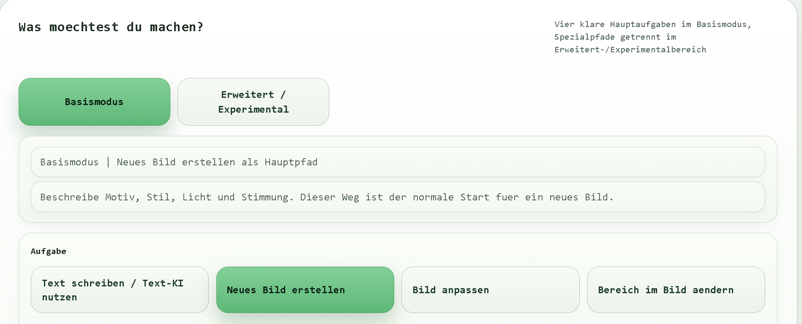

# Local Image AI

[](https://opensource.org/licenses/MIT)
[](https://www.python.org/downloads/)
[](https://github.com/mickhornung-oss/local-image-ai/releases)
[](https://codecov.io/gh/mickhornung-oss/local-image-ai)
[](https://github.com/mickhornung-oss/local-image-ai/actions)

Lokale Windows-App fuer Text-KI und Bild-KI im selben Produkt.

## 📸 Demo



*Text-KI für Prompts und Umformulierung, Bild-KI für Generierung und Bearbeitung - alles in einer App.*

## ⚡ Quick Start

```powershell
# 1. Repository klonen
git clone https://github.com/mickhornung-oss/local-image-ai.git
cd local-image-ai

# 2. Virtual Environment & Dependencies
python -m venv .venv
.\venv\Scripts\Activate.ps1
pip install -r requirements.txt

# 3. App starten
python python/app_server.py

# 4. Browser öffnen
# → http://localhost:5000
```

✅ UI erscheint automatisch | Text & Bild-KI sofort einsatzbereit

## MP-04 Abschlussdokumente

Verbindliche Hauptdokumente fuer den heutigen Produktstand:

- Produktdoku: `docs/product_core_mp01.md`
- Technische Abschlussdoku: `docs/technical_closeout_mp04.md`
- Praesentationsgrundlage: `docs/project_presentation_mp04.md`

Diese drei Dokumente bilden zusammen den offiziellen MP-04-Abschlussstand. Aeltere Arbeits-, Snapshot- und V*-Dokumente bleiben erhalten, sind aber nicht das kanonische Hauptbild.

## MP-01 Produktkern

Dieser Stand zieht den aktiven Produktkern verbindlich fest.

Produktiv:
- `Text schreiben / Text-KI nutzen`
- gespeicherte Chats in `data/text_chats.sqlite3`
- Prompt-Hilfe / Prompt-Schreiben inkl. Prompt-Uebergabe in die Bild-KI
- Uebersetzungs- und Umformulierungsnutzung ueber die Text-KI-Arbeitsmodi
- `Neues Bild erstellen`
- `Bild anpassen`
- `Bereich im Bild aendern`
- Ergebnisgalerie, Vorschau, Download, Export, Wiederladen und Loeschen

Experimentell, aber aktiver Projektbestand:
- `Neue Szene mit derselben Person`
- `V6.1 Single-Reference`
- `V6.2 Multi-Reference`
- `V6.3 Identity Transfer`
- `V6.8 Masken-Hybrid`
- `identity_research` / `scripts/run_identity_research_ab.py`

Legacy / historisch / Nebenbestand:
- `backend/`
- `vscode-extension/`
- `main.py`
- `stable-diffusion-webui/`
- Alt-Doku zu `Code KI V1` in `docs/architecture.md` und `docs/project_documentation.md`

Kanonische MP-01-Uebernahmedoku:
- `docs/product_core_mp01.md`

Die reale Hauptanwendung in diesem Repository besteht aus:
- Browser-UI unter `web/`
- lokalem App-Server unter `python/app_server.py`
- lokalem Text-Service unter `python/text_service.py`
- lokalem Text-Runner unter `vendor/text_runner/`
- lokaler Bild-Engine ueber ComfyUI unter `vendor/ComfyUI/`

## Aktiver Produktumfang

- Text-KI mit Chat-Slots und Modellprofilen
- Bild-KI fuer `Neues Bild erstellen`, `Bild anpassen` und `Bereich im Bild aendern`
- Identity-Pfade fuer Single-Reference, Multi-Reference und Transfer-Varianten
- Ergebniswelt mit Vorschau, Galerie, Export und Wiederverwendung
- lokale Status-, Health- und Readiness-Endpunkte

## MP-03 UI-Struktur

- `Basismodus` ist der normale Produktweg fuer:
  - `Text schreiben / Text-KI nutzen`
  - `Neues Bild erstellen`
  - `Bild anpassen`
  - `Bereich im Bild aendern`
- `Erweitert / Experimental` sammelt bewusst getrennt:
  - `Neue Szene mit derselben Person`
  - Mehrbild-/Transfer-/Masken-Hybrid-Pfade
  - technische Readiness- und Teststarts
- Die Ergebniswelt im sichtbaren Hauptpfad bleibt auf Vorschau, Download, Export, Wiederverwendung und Entfernen aus der Hauptliste ausgerichtet.

## Textmodi

- `Standard` ist der produktive Default fuer normales Schreiben, mittlere Nutztexte und Prompt-Hilfe.
- `Starkes Schreiben` ist der gezielte Langtextpfad fuer laengere Schreibaufgaben.
- `Mehrsprachig` ist der gezielte Pfad fuer Uebersetzen und Umformulieren.
- Neue Chats und ungebundene Text-Requests fallen standardmaessig auf `Standard` zurueck und erben nicht still ein zuvor aktives schweres Profil.
- Produktive Zielgrenzen:
  - `Standard`: kurze Hilfe und normale Schreibauftraege, praxisnah fuer grob `140-220` Woerter bei einem Ziel von `160-200`
  - `Starkes Schreiben`: laengere Schreibauftraege und Langtext; kann lokal auf CPU deutlich laenger laufen und ist fuer grob `500-800` Woerter gedacht
  - `Mehrsprachig`: Uebersetzen und Umformulieren mit klarer Zielsprache

## Start

Offizieller Hauptstartpfad:

1. `Start_Local_Image_AI.cmd`
2. Browser auf `http://127.0.0.1:8090`

Offizieller technischer Startpfad:

1. `powershell -ExecutionPolicy Bypass -File .\scripts\run_stack.ps1 -Action start -UserMode`
2. `powershell -ExecutionPolicy Bypass -File .\scripts\run_stack.ps1 -Action status -UserMode`

Offizieller Statuspfad:

1. `Status_Local_Image_AI.cmd`
2. oder `powershell -ExecutionPolicy Bypass -File .\scripts\run_stack.ps1 -Action status -UserMode`

Offizieller Stop-Pfad:

1. `Stop_Local_Image_AI.cmd`
2. oder `powershell -ExecutionPolicy Bypass -File .\scripts\run_stack.ps1 -Action stop -UserMode`

Einzelstarts:

- App: `scripts/run_app.ps1`
- Text-Service: `scripts/run_text_service.ps1`
- Text-Runner: `scripts/run_text_runner.ps1`
- ComfyUI: `scripts/run_comfyui.ps1`

## Wichtige Pfade

- Produkt-UI: `web/index.html`
- Hauptserver: `python/app_server.py`
- Text-Service: `python/text_service.py`
- Chat-Store/Persistenz: `python/text_chat_store.py`
- Chat-Payloads/Overviews: `python/text_chat_payloads.py`
- Chat-Requests/Action-Aufloesung: `python/text_chat_requests.py`
- Chat-Responses/Slot-Detail-Antworten: `python/text_chat_responses.py`
- Chat-Text-Service-Orchestrierung: `python/text_chat_service_orchestration.py`
- Upload-Input-Validierung: `python/image_input_validation.py`
- Upload-Store/Metadaten/Nachlauf: `python/upload_store.py`
- Result-/Output-/Export-Nachlauf: `python/result_output.py`
- Generate-Endpunktkoordination: `python/generate_endpoint_flow.py`
- Allgemeine Generate-Vorverdrahtung: `python/general_generate_flow.py`
- App-Pfade/Resolver: `python/app_paths.py`
- App-Request-Helfer: `python/app_request_utils.py`
- Bild-Runner: `python/render_text2img.py`
- Konfiguration Text-Service: `config/text_service.json`
- Ergebnisdaten und lokale Stores: `data/`
- Windows-Startlogik: `scripts/`

## Umgebung

- Windows-first Projekt
- ComfyUI und ML-Abhaengigkeiten nicht mit globalem Python 3.14 betreiben
- Fuer ComfyUI-Setup `scripts/setup_windows.ps1` verwenden
- `scripts/setup_windows.ps1` installiert auch die Python-Runtime fuer die aktiven Identity-Custom-Nodes (`ComfyUI_InstantID`, `PuLID_ComfyUI`)
- Der aktuell sichtbare `ComfyUI_ACE-Step`-/`torchaudio`-Konflikt blockiert den heutigen Produktkern nicht; der Node ist derzeit kein aktiver Pflichtpfad fuer Text-, Standard-Bild- oder Identity-Generates
- Grosse Modelle bleiben ausserhalb von Git unter `vendor/ComfyUI/models/` bzw. `vendor/text_models/`

## Projektbild

Dieses Repository enthaelt neben der aktiven Hauptanwendung auch aeltere Teilbereiche.

Aktiv fuer das heutige Produkt:
- `python/`
- `web/`
- `scripts/`
- `config/text_service.json`
- `data/`

Legacy / historisch, aktuell nicht der Hauptpfad:
- `backend/`
- `vscode-extension/`
- `main.py`
- `stable-diffusion-webui/`

Diese Altbereiche bleiben im Repository erhalten, beschreiben aber nicht mehr die heutige Hauptanwendung.

## Chat-Modulgruppe

Der Chat-Bereich ist heute kein einzelner Block mehr in `python/app_server.py`, sondern eine kleine interne Modulgruppe mit klareren Grenzen:

- `python/text_chat_store.py`
  - lokale Chat-Persistenz, Slot-State und SQLite-Zugriffe
- `python/text_chat_payloads.py`
  - Slot-Overviews und Chat-Overview-Payloads fuer API-nahe Antworten
- `python/text_chat_requests.py`
  - chat-bezogene Request-Normalisierung, Action-Aufloesung und kleine Vorvalidierung
- `python/text_chat_responses.py`
  - finale Slot-Detail-Responses aus bereits vorbereiteten Daten
- `python/text_chat_service_orchestration.py`
  - Vorbereitung des Text-Service-Aufrufs, Retry-/Fehler-Mapping und kleine Nachbereitung fuer den Chat-Pfad

Was weiterhin in `python/app_server.py` bleibt:

- HTTP-Endpunkte und Browser-Einstieg
- uebergeordnete Ablaufkoordination der Chat-Handler
- Kopplung zwischen Chat, Text-Service, Modellprofilwechsel und den restlichen Produktpfaden
- Fehlerbehandlung auf Endpunkt-Ebene

Bewusst noch nicht weiter gezogen:

- die komplette Chat-Handler-Ablaufsteuerung
- die allgemeine Text-Service-Kommunikation ausserhalb des Chat-Pfads
- andere Produktbereiche wie Bild-Generate, Uploads, Result-Store oder Identity-Pfade

## Upload-/Store-Modulgruppe

Der bild- und identity-nahe Upload-Eingang ist heute nicht mehr nur Handlercode in `python/app_server.py`, sondern besteht aus einer kleinen internen Modulgruppe:

- `python/image_input_validation.py`
  - request-nahe Upload-Validierung, Multipart-Parsing, Bild-/Masken-/Slot-/Rollen-Normalisierung
- `python/upload_store.py`
  - Dateispeicherung, upload-nahe Input-Metadaten, Beschreibungslogik und Erfolgsantworten fuer Input-, Reference-, Multi-Reference-, Rollen- und Masken-Uploads

Was weiterhin in `python/app_server.py` bleibt:

- HTTP-Endpunkte und handlernahe Ablaufkoordination
- Kopplung zwischen Uploadpfaden und den restlichen Produktbereichen
- nachgelagerte Generate-/Render-Pfade, Result-Logik und Endpunktfehlerbehandlung

## Result-/Output-Modulgruppe

Der Ergebnis-Nachlauf ist heute ebenfalls nicht mehr nur Servercode in `python/app_server.py`:

- `python/result_output.py`
  - Ergebnisfinalisierung, Result-Store-Metadaten, Export-/Delete-Nachlauf und outputnahe Erfolgsantworten

Was weiterhin in `python/app_server.py` bleibt:

- Endpunktnahe Request-Pruefung fuer Results/Export/Delete
- Handlerkoordination rund um Render-Aufruf und HTTP-Antworten
- die eigentlichen Generate-/Render-Implementierungen

## Generate-Koordinationsmodul

- `python/generate_endpoint_flow.py`
  - handlernahe Ablaufsteuerung zwischen Busy-/Fehler-Routing, Render-Call, Finalisierung und finaler HTTP-Antwort fuer Generate-Endpunkte
- `python/general_generate_flow.py`
  - allgemeine Bild-Generate-Vorverdrahtung, request-nahe Normalisierung und systemnahe Fehlerverdrahtung vor `run_render(...)`

## Restliche Kalte App-Server-Helfer

- `python/app_paths.py`
  - Pfadroots, Datei-Resolver, Web-Pfad-Abbildung, Directory-Access-Zustaende und reset-/download-nahe Pfadhelfer
- `python/app_request_utils.py`
  - JSON-Dateilesen, kleine Request-/Query-Helfer, Data-URL-Decoding und einfache Payload-Normalisierung

## App-Server-Restkern

`python/app_server.py` ist fuer die aktuelle Projektphase bewusst kein weiterer Zerlegekandidat mehr.

Der verbleibende Restkern ist heute hauptsaechlich:

- HTTP-Endpunkte und Routing
- Laufzeitverdrahtung zwischen den ausgelagerten Modulgruppen
- Servicekopplung und produktnahe Ablaufkoordination
- servernahe Fehlerbehandlung auf Endpunkt-Ebene

Weiterer aggressiver Umbau dieses Restkerns ist aktuell nicht Ziel, solange keine konkreten Testfunde oder klar wiederholten fachlichen Probleme dafuer sprechen.

## Tests

Leichter lokaler Smoke:

- `powershell -ExecutionPolicy Bypass -File .\scripts\smoke_test.ps1`
- `powershell -ExecutionPolicy Bypass -File .\scripts\ui_smoke_test.ps1`

Python-Unittests:

- `venv\Scripts\python.exe -m unittest discover -s tests`

Heutiger Testmix:

- Modul-Unittests fuer die ausgelagerten Hilfs- und Ablaufmodule
- handlernahe Integrations-/Endpoint-Tests mit Mocks fuer repraesentative Produktpfade
- lokaler Smoke-Test ueber `scripts/smoke_test.ps1`
- `scripts/smoke_test.ps1` liefert bei Bild-Smokes auch `elapsed_seconds`, damit lokale Laufzeitlast von echten Fehlern getrennt werden kann
- browsernaher UI-Smoke ueber `scripts/ui_smoke_test.ps1`, inklusive kleiner echter Klickpfade fuer Hauptansicht, Text-Hauptpfad und Ergebnisvorschau
- realer Live-Check ueber `scripts/run_stack.ps1 -Action status -UserMode`, `/health` und die Identity-Readiness-Endpunkte

Sinnvoller Minimal-Live-Smoke auf heutigem Produktstand:

1. `powershell -ExecutionPolicy Bypass -File .\scripts\run_stack.ps1 -Action start -UserMode`
2. `powershell -ExecutionPolicy Bypass -File .\scripts\run_stack.ps1 -Action status -UserMode`
3. `powershell -ExecutionPolicy Bypass -File .\scripts\smoke_test.ps1`
4. `powershell -ExecutionPolicy Bypass -File .\scripts\ui_smoke_test.ps1`
5. `GET /health`
6. `GET /identity-reference/readiness`
7. `GET /identity-transfer/readiness`

Der offizielle MP-01-Produktkern, die Klassifikation Produktiv / Experimentell / Historisch sowie der verbindliche Start-, Status- und Pruefpfad sind in `docs/product_core_mp01.md` festgezogen.
