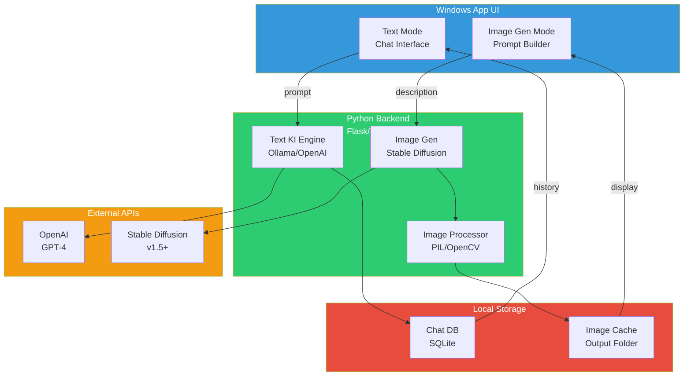

# Historisches Dokument - Code KI V1 (Veraltet)

## System Design - Local Image AI (Aktuell)

## Active Product Core (MP-01)

Für den aktiven Produktkern siehe:
- `README.md`
- `docs/product_core_mp01.md`
- `docs/technical_closeout_mp04.md`

### Produktive Features (MP-01)
- Text KI Chat + Persistierung
- Image Generation (mit Stable Diffusion)
- Image Refinement & Inpainting
- Gallery + Download/Export
- V6 Identity Engine (Research)

### Performance (RTX 4090)
- Image Gen: ~3-5s pro 1024x1024
- Memory: ~8GB VRAM + 4GB RAM
- Cache: 100 Bilder In-Memory

---

# Dieses Dokument - Code KI V1 (Historisch)

## Ziel

Eine lokale Python-KI fuer VS Code, die enge Arbeitsauftraege mit sichtbarem Codekontext verarbeitet.

## V1-Bausteine

1. VS-Code-Erweiterung
- nimmt Prompt und optionalen Traceback entgegen
- liest aktive Datei und Markierung
- sendet alles an das lokale Backend
- zeigt die Antwort kontrolliert an

2. Kontextsammler
- aktive Datei
- markierter Bereich
- Workspace-Pfad
- optionaler Fehlertext

3. Regel- und Prompt-Schicht
- klarer Python-Fokus
- konservative Regeln
- keine ungefragten Grossumbauten

4. Lokales Modellbackend
- FastAPI + `llama-cpp-python`
- GGUF-Modell lokal ueber Dateipfad
- localhost-Kommunikation

5. Ausgabeblock
- reine Ergebnisanzeige
- keine automatische Uebernahme

## Warum diese Architektur

- klein genug fuer ein Abschlussprojekt
- lokal und nachvollziehbar
- spaeter modular ausbaubar
- keine unnötige Fremdschicht wie Ollama im V1-Kern
